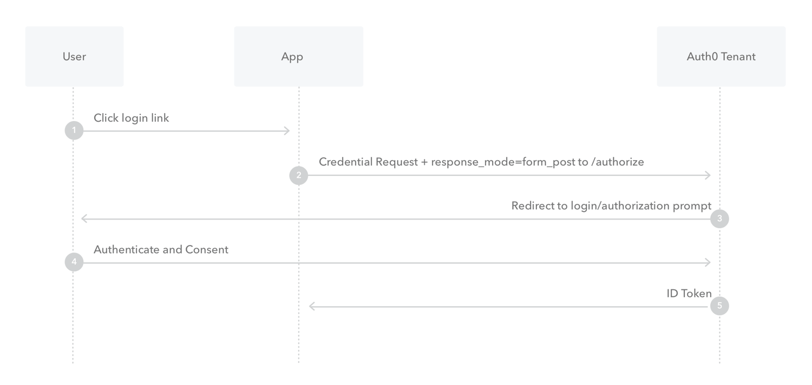

# Authentication

## Index

[Home](../README.md)  
[What is OAuth](#what-is-oauth)  
[Authorization and Authentication Flows](#authorization-and-authentication-flows)  

## [What is OAuth](https://www.csoonline.com/article/3216404/what-is-oauth-how-the-open-authorization-framework-works.html)

1. What is OAuth?
   - OAuth is an open-standard authorization protocol or framework that describes how unrelated servers and services can safely allow authenticated access to their assets without actually sharing the initial, related, single logon credential. In authentication parlance, this is known as secure, third-party, user-agent, delegated authorization.
2. Give an example of what using OAuth would look like.
   - When asked to login to an exsisting or new account, options to pass that log in using a "Google" account for example might be present.  As described here:
     - The simplest example of OAuth is when you go to log onto a website and it offers one or more opportunities to log on using another website’s/service’s logon. You then click on the button linked to the other website, the other website authenticates you, and the website you were originally connecting to logs you on itself afterward using permission gained from the second website.
     - Another common example OAuth scenario could be a user sending cloud-stored files to another user via email, when the cloud storage and email systems are otherwise unrelated other than supporting the OAuth framework (e.g., Google Gmail and Microsoft OneDrive). When the end-user attaches the files to their email and browses to select the files to attach, OAuth could be used behind the scenes to allow the email system to seamlessly authenticate and browse to the protected files without requiring a second logon to the file storage system
     - Another example: An end-user using a third-party printing service to print picture files stored on an unrelated web server.
3. How does OAuth work? What are the steps that it takes to authenticate the user?
   1. The first website connects to the second website on behalf of the user, using OAuth, providing the user’s verified identity.
   2. The second site generates a one-time token and a one-time secret unique to the transaction and parties involved.
   3. The first site gives this token and secret to the initiating user’s client software.
   4. The client’s software presents the request token and secret to their authorization provider (which may or may not be the second site).
   5. If not already authenticated to the authorization provider, the client may be asked to authenticate. After authentication, the client is asked to approve the authorization transaction to the second website.
   6. The user approves (or their software silently approves) a particular transaction type at the first website.
   7. The user is given an approved access token (notice it’s no longer a request token).
   8. The user gives the approved access token to the first website.
   9. The first website gives the access token to the second website as proof of authentication on behalf of the user.
   10. The second website lets the first website access their site on behalf of the user.
   11. The user sees a successfully completed transaction occurring.
4. What is OpenID?
   - OpenID is about authentication: as a commenter on StackOverflow [pithily put it](https://stackoverflow.com/questions/4230821/if-openid-is-dead-what-is-out-there-to-take-its-place/4230970#4230970): "OpenID is for humans logging into machines, OAuth is for machines logging into machines on behalf of humans."

## [Authorization and Authentication Flows](https://auth0.com/docs/flows)

| Authentication                                                                                                                         | Authorization                                                                                                                         |
|----------------------------------------------------------------------------------------------------------------------------------------|---------------------------------------------------------------------------------------------------------------------------------------|
| Determines whether users are who they claim to be                                                                                      | Determines what users can and cannot access                                                                                           |
| Challenges the user to validate credentials (for example, through passwords,  answers to security questions, or facial recognition) | Verifies whether access is allowed through policies and rules                                                                         |
| Usually done before authorization                                                                                                      | Usually done after successful authentication                                                                                          |
| Generally, transmits info through an ID Token                                                                                          | Generally, transmits info through an Access Token                                                                                     |
| Generally governed by the OpenID Connect (OIDC) protocol                                                                               | Generally governed by the OAuth 2.0 framework                                                                                         |
| Example: Employees in a company are required to authenticate through  the network before accessing their company email              | Example: After an employee successfully authenticates,  the system determines what information the employees are allowed to access |

1. What is the difference between authorization and authentication?
   - [Authentication vs. Authorization](https://auth0.com/docs/get-started/identity-fundamentals/authentication-and-authorization)  
   - In simple terms, authentication is the process of verifying who a user is, while authorization is the process of verifying what they have access to.  
   Comparing these processes to a real-world example, when you go through security in an airport, you show your ID to authenticate your identity. Then, when you arrive at the gate, you present your boarding pass to the flight attendant, so they can authorize you to board your flight and allow access to the plane.
2. What is [Authorization Code Flow](https://auth0.com/docs/get-started/authentication-and-authorization-flow/authorization-code-flow)?
   - [Add Login Using the Authorization Code Flow](https://auth0.com/docs/get-started/authentication-and-authorization-flow/add-login-auth-code-flow)
   - [Call API Using the Authorization Code Flow](https://auth0.com/docs/get-started/authentication-and-authorization-flow/call-your-api-using-the-authorization-code-flow)
   - 
3. What is Authorization Code Flow with Proof Key for Code Exchange (PKCE)?  
   - Overview  
     Key Concepts
     - Learn about the OAuth 2.0 grant type, Authorization Code Flow with Proof Key for Code Exchange (PKCE).
     - Use this grant type for applications that cannot store a client secret, such as native or single-page apps.
     - Review different implementation methods with Auth0 SDKs.
4. What is Implicit Flow with Form Post?
   - Implicit Flow with Form Post flow uses OIDC to implement web sign-in that is very similar to the way SAML and WS-Federation operates. The web app requests and obtains tokens through the front channel, without the need for secrets or extra backend calls. With this method, you don’t need to obtain, maintain, use, and protect a secret in your application.
   - 
      1. The user clicks Login in the app.
      2. Auth0's SDK redirects the user to the Auth0 Authorization Server (`/authorize` endpoint) passing along a `response_type` parameter of `id_token` that indicates the type of requested credential. It also passes along a `response_mode` parameter of `form_post` to ensure security.
      3. Your Auth0 Authorization Server redirects the user to the login and authorization prompt.
      4. The user authenticates using one of the configured login options and may see a consent page listing the permissions Auth0 will give to the app.
      5. Your Auth0 Authorization Server redirects the user back to the app with an ID Token.
5. What is [Client Credentials Flow](https://auth0.com/docs/get-started/authentication-and-authorization-flow/client-credentials-flow)?
   - With machine-to-machine (M2M) applications, such as CLIs, daemons, or services running on your back-end, the system authenticates and authorizes the app rather than a user. For this scenario, typical authentication schemes like username + password or social logins don't make sense. Instead, M2M apps use the Client Credentials Flow ([defined in OAuth 2.0 RFC 6749, section 4.4](https://tools.ietf.org/html/rfc6749#section-4.4)), in which they pass along their Client ID and Client Secret to authenticate themselves and get a token.
   - 
      1. The application authenticates with the Auth0 Authorization Server using its Client ID and Client Secret (`/oauth/token` [endpoint](https://auth0.com/docs/api/authentication?http#client-credentials-flow)).
      2. Auth0 Authorization Server validates the Client ID and Client Secret.
      3. Auth0 Authorization Server responds with an access token.
      4. The application can use the access token to call an API on behalf of itself.
      5. The API responds with requested data.
6. What is [Device Authorization Flow](https://auth0.com/docs/get-started/authentication-and-authorization-flow/device-authorization-flow)?
   - With input-constrained devices that connect to the internet, rather than authenticate the user directly, the device asks the user to go to a link on their computer or smartphone and authorize the device. This avoids a poor user experience for devices that do not have an easy way to enter text. To do this, device apps use the Device Authorization Flow (ratified in OAuth 2.0), in which they pass along their Client ID to initiate the authorization process and get a token.  
   How it works  
   The Device Authorization Flow contains two different paths; one occurs on the device requesting authorization and the other occurs in a browser. The browser flow path, wherein a device code is bound to the session in the browser, occurs in parallel to part of the device flow path.
   - 
      1. The user starts the app on the device.
      2. The device app requests authorization from the Auth0 Authorization Server using its Client ID (`/oauth/device/code` endpoint).
      3. The Auth0 Authorization Server responds with a `device_code`, `user_code`, `verification_uri`, `verification_uri_complete` `expires_in` (lifetime in seconds for `device_code` and `user_code`), and polling `interval`.
      4. The device app asks the user to activate using their computer or smartphone. The app may accomplish this by:
         - asking the user to visit the `verification_uri` and enter the `user_code` after displaying these values on-screen
         - asking the user to interact with either a QR Code or shortened URL with embedded user code generated from the `verification_uri_complete`
         - directly navigating to the verification page with embedded user code using `verification_uri_complete`, if running natively on a browser-based device

      5. The device app begins polling your Auth0 Authorization Server for an Access Token (/oauth/token endpoint) using the time period specified by `interval` and counting from receipt of the last polling request's response. The device app continues polling until either the user completes the browser flow path or the user code expires.
      6. When the user successfully completes the browser flow path, your Auth0 Authorization Server responds with an Access Token (and optionally, a Refresh Token). The device app should now forget its `device_code` because it will expire.
      7. Your device app can use the Access Token to call an API to access information about the user.
      8. The API responds with requested data.
7. What is [Resource Owner Password Flow](https://auth0.com/docs/get-started/authentication-and-authorization-flow/resource-owner-password-flow)?
   - Though we do not recommend it, highly-trusted applications can use the Resource Owner Password Flow (defined in [OAuth 2.0 RFC 6749, section 4.3](https://tools.ietf.org/html/rfc6749#section-4.3)), which requests that users provide credentials (username and password), typically using an interactive form. Because credentials are sent to the backend and can be stored for future use before being exchanged for an Access Token, it is imperative that the application is absolutely trusted with this information.  
   Even if this condition is met, the Resource Owner Password Flow should only be used when redirect-based flows (like the Authorization Code Flow) cannot be used.
   - 
      1. The user clicks Login within the application and enters their credentials.
      2. Your application forwards the user's credentials to your Auth0 Authorization Server (`/oauth/token` endpoint).
      3. Your Auth0 Authorization Server validates the credentials.
      4. Your Auth0 Authorization Server responds with an Access Token (and optionally, a Refresh Token).
      5. Your application can use the Access Token to call an API to access information about the user.
      6. The API responds with requested data.

[Back To Top](#index)
