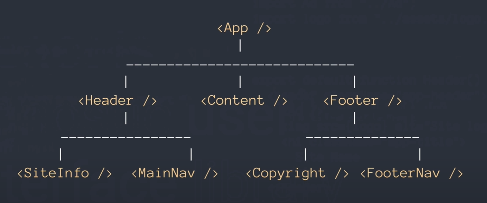

# [What is React](https://youtu.be/FRjlF74_EZk)

- A user interface Library.

1. What is a component?

- A small piece of code that fills a certain part of the user interface.

2. What is the dataflow of React?

- One way dataflow.
- Data flows down.

3. How do we make a React element a DOM element?

- By using a JavaScript function.

```js
import React from ‘react’;
import ReactDOM from ‘react-dom’;
import Header from ‘./Header’;
import Content from ‘./Content’;
import Footer from ‘./Footer’;

Function App(){
	<div className=’app’>
		<Header />
		<Content />
		<Footer />
	</div>
}

ReactDOM.redner(
	<App />,
	document.getElementById(‘root’)
);
```

4. React is a User Interface _____

- Library
- Agnostic User Interface Library.

5. Which direction does data flow in React?

- Data flows downward.  


6. Every component manages its own ____

- *State* and pass it down to its children.

[Back To Top](#what-is-react)
