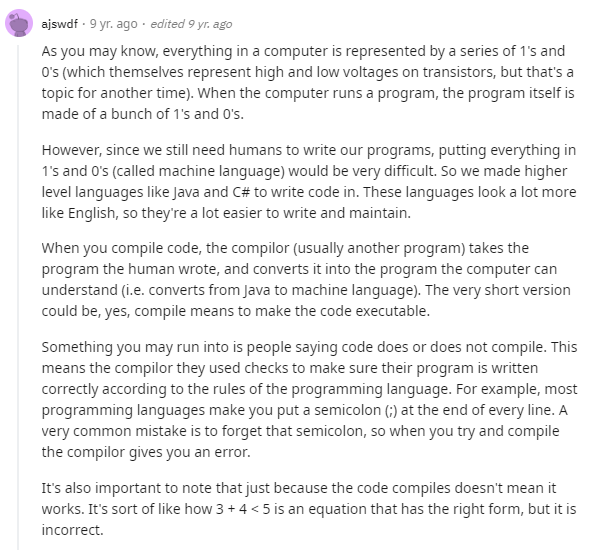

# [Java Basics](https://docs.oracle.com/javase/tutorial/java/nutsandbolts/index.html)

## Index

[Home](../README.md)  
[Variables](#variables)  
[Operators](#operators)  
[Expressions, Statments and Blocks](#expressions-statements-and-blocks)  
[Control Flow Statments](#control-flow-statements)  
[What Does It Mean To Compile Code](#what-does-it-mean-to-compile-code)  
[Explain Like I'm Five](#explain-like-im-five)  
[Questions](#questions)  

## Variables

The Java programming language defines the following kinds of variables:

- `Instance Variables (Non-Static Fields)` Technically speaking, objects store their individual states in "non-static fields", that is, fields declared without the `static` keyword. Non-static fields are also known as *instance variables* because their values are unique to each *instance* of a class (to each object, in other words); the `currentSpeed` of one bicycle is independent from the currentSpeed of another.  

- `Class Variables (Static Fields)` A *class variable* is any field declared with the `static` modifier; this tells the compiler that there is exactly one copy of this variable in existence, regardless of how many times the class has been instantiated. A field defining the number of gears for a particular kind of bicycle could be marked as `static` since conceptually the same number of gears will apply to all instances. The code `static int numGears = 6;` would create such a static field. Additionally, the keyword `final` could be added to indicate that the number of gears will never change.  

- `Local Variables` Similar to how an object stores its state in fields, a method will often store its temporary state in *local variables*. The syntax for declaring a local variable is similar to declaring a field (for example, `int count = 0;`). There is no special keyword designating a variable as local; that determination comes entirely from the location in which the variable is declared — which is between the opening and closing braces of a method. As such, local variables are only visible to the methods in which they are declared; they are not accessible from the rest of the class.  

- `Parameters` Given `public static void main(String[] args)`, the `args` variable is the parameter to this method. The important thing to remember is that parameters are always classified as "variables" not "fields". This applies to other parameter-accepting constructs as well (such as constructors and exception handlers).  

## Operators

| postfix              | expr++ expr--                           |
|----------------------|-----------------------------------------|
| unary                | ++expr --expr +expr -expr ~ !           |
| multiplicative       | * / %                                   |
| additive             | + -                                     |
| shift                | << >> >>>                               |
| relational           | < > <= >= instanceof                    |
| equality             | == !=                                   |
| bitwise AND          | &                                       |
| bitwise exclusive OR | ^                                       |
| bitwise inclusive OR | \|                                      |
| logical AND          | &&                                      |
| logical OR           | \|\|                                    |
| ternary              | ? :                                     |
| assignment           | = += -= *= /= %= &= ^= \|= <<= >>= >>>= |

## Expressions, Statements, and Blocks

### Expressions

An *expression* is a construct made up of variables, operators, and method invocations, which are constructed according to the syntax of the language, that evaluates to a single value.  

Examples:

- Taken *int cadence = 0;* `cadence = 0` is the expression.
- Taken *int result = 1 + 2;* `result = 1 + 2` is the expression.

The data type of the value returned by an expression depends on the elements used in the expression.

### Statements

Statements are roughly equivalent to sentences in natural languages. A statement forms a complete unit of execution. The following types of expressions can be made into a statement by terminating the expression with a semicolon (;).

- Assignment expressions
- Any use of ++ or --
- Method invocations
- Object creation expressions

```Java
// assignment statement
aValue = 8933.234;
// increment statement
aValue++;
// method invocation statement
System.out.println("Hello World!");
// object creation statement
Bicycle myBike = new Bicycle();
```

### Blocks

A block is a group of zero or more statements between balanced braces and can be used anywhere a single statement is allowed.  

```Java
class BlockDemo {
     public static void main(String[] args) {
          boolean condition = true;
          if (condition) { // begin block 1
               System.out.println("Condition is true.");
          } // end block one
          else { // begin block 2
               System.out.println("Condition is false.");
          } // end block 2
     }
}
```

## Control Flow Statements

The statements inside your source files are generally executed from top to bottom, in the order that they appear. *Control flow statements*, however, break up the flow of execution by employing decision making, looping, and branching, enabling your program to *conditionally* execute particular blocks of code. This section describes the decision-making statements `(if-then, if-then-else, switch)`, the looping statements `(for, while, do-while)`, and the branching statements `(break, continue, return)` supported by the Java programming language.

## What Does It Mean To Compile Code


### Explain Like I'm Five



## Questions

1. What does "strong typed" mean?

   - Strong typed languages require data to be explicitly declared and will not allow implied but not declared data types.

2. Explain to a non-technical friend the difference in how compilation works in Java and JavaScript.

   - Java is a compiled programming language. Meaning that written code is handled by another program that translates it to machine language (0's and 1's).  Think of Java acting as a way to better read and write code for humans and the compiler translates that to a non english speaking entity (a computer processor). Compiled languages are typically faster than interpred languages.  

   - JavaScript is an interpreted language. A program called an interpreter reads line by line and executes the code it reads immediately, never handing it down to the processor in machine language.

[Back To Top](#java-basics)
