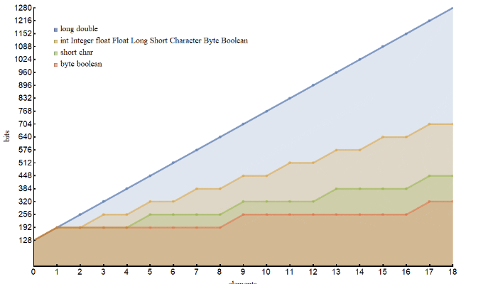
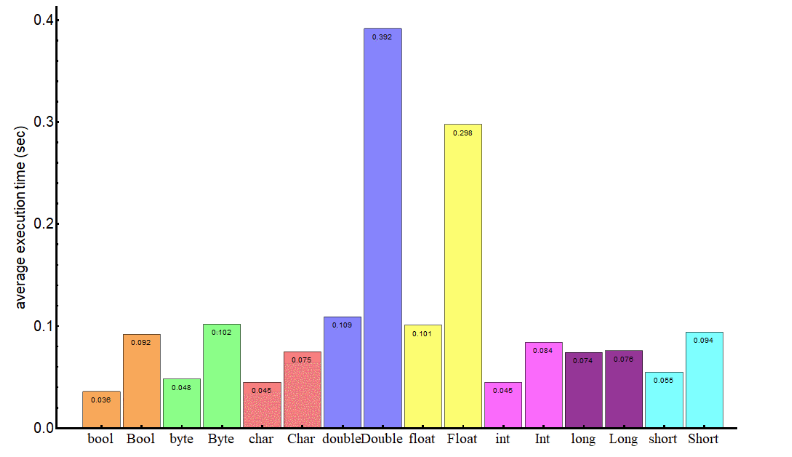

# Class 03

## Index

[Home](../README.md)  
[Primitives vs. Objects](#primitives-vs-objects)  
[Exceptions vs. Objects](#exceptions-in-java)  
[Using Scanner](#using-scanner-to-read-in-a-file-in-java)  

## [Primitives vs. Objects](https://www.baeldung.com/java-primitives-vs-objects)

- The wrapper classes are immutable (so that their state can't change once the object is constructed) and are final (so that we can't inherit from them).

```Java
Integer j = 1;          // autoboxing
int i = new Integer(1); // unboxing
```

- the primitive type variables have the following impact on the memory. These values can vary depending on the Virtual Machine implementation:
  - boolean – 1 bit
  - byte – 8 bits
  - short, char – 16 bits
  - int, float – 32 bits
  - long, double – 64 bits

  - Boolean – 128 bits
  - Byte – 128 bits
  - Short, Character – 128 bits
  - Integer, Float – 128 bits
  - Long, Double – 192 bits



- long, double: m(s) = 128 + 64 s
- short, char: m(s) = 128 + 64 \[s/4\]
- byte, boolean: m(s) = 128 + 64 \[s/8\]
- the rest: m(s) = 128 + 64 \[s/2\]

To summarize, objects in Java are slower and have a bigger memory impact than their primitive analogs. Depending on the projects memory needs, use what makes the most sense.



## [Exceptions in Java](https://docs.oracle.com/javase/tutorial/essential/exceptions/index.html)

### What is an Exception?

An *exception* is an event, which occurs during the execution of a program, that disrupts the normal flow of the program's instructions.  

Creating an exception object and handing it to the runtime system is called throwing an exception.

The runtime system searches the call stack for a method that contains a block of code that can handle the exception. This block of code is called an `exception handler`. The exception handler chosen is said to `catch the exception`.  

### Catching and Handling Exceptions

Here are three exception handler components:  

`try`  
`catch`  
`finally`

Here is an example of handling exceptions:

```Java
import java.io.*;
import java.util.List;
import java.util.ArrayList;

public class ListOfNumbers {

    private List<Integer> list;
    private static final int SIZE = 10;

    public ListOfNumbers () {
        list = new ArrayList<Integer>(SIZE);
        for (int i = 0; i < SIZE; i++) {
            list.add(new Integer(i));
        }
    }

    public void writeList() {
    // The FileWriter constructor throws IOException, which must be caught.
        PrintWriter out = new PrintWriter(new FileWriter("OutFile.txt"));

        for (int i = 0; i < SIZE; i++) {
            // The get(int) method throws IndexOutOfBoundsException, which must be caught.
            out.println("Value at: " + i + " = " + list.get(i));
        }
        out.close();
    }
}
```

The first line in boldface is a call to a constructor. The constructor initializes an output stream on a file. If the file cannot be opened, the constructor throws an IOException. The second boldface line is a call to the ArrayList class's get method, which throws an IndexOutOfBoundsException if the value of its argument is too small (less than 0) or too large (more than the number of elements currently contained by the ArrayList).  

If you try to compile the ListOfNumbers class, the compiler prints an error message about the exception thrown by the FileWriter constructor. However, it does not display an error message about the exception thrown by get. The reason is that the exception thrown by the constructor, IOException, is a checked exception, and the one thrown by the get method, IndexOutOfBoundsException, is an unchecked exception.

## [Using Scanner to read in a file in Java](https://docs.oracle.com/javase/tutorial/essential/io/scanning.html)

Objects of type `Scanner` are useful for breaking down formatted input into tokens and translating individual tokens according to their data type.  

Here is a quick and dirty example:

```java
import java.io.*;
import java.util.Scanner;

public class ScanXan {
    public static void main(String[] args) throws IOException {

        Scanner s = null;

        try {
            s = new Scanner(new BufferedReader(new FileReader("xanadu.txt")));

            while (s.hasNext()) {
                System.out.println(s.next());
            }
        } finally {
            if (s != null) {
                s.close();
            }
        }
    }
}
```

[Back To Top](#class-03)