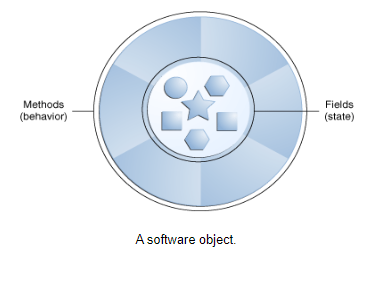
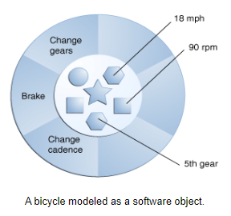
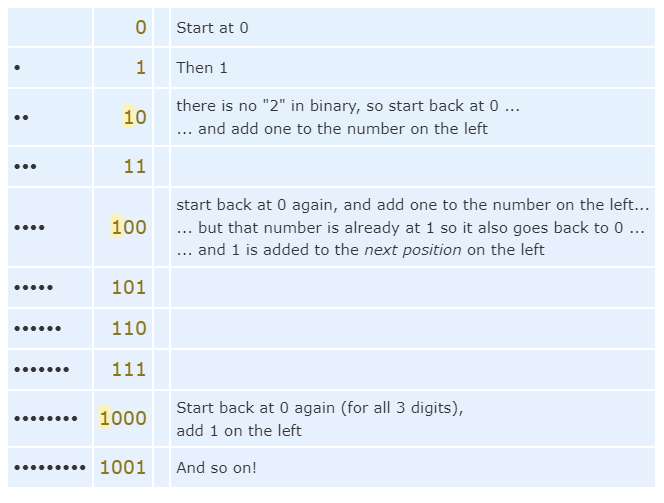
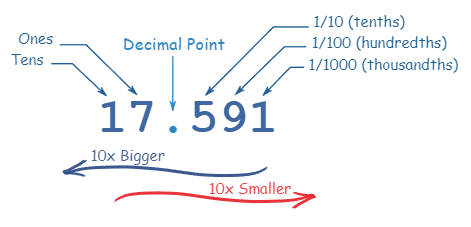
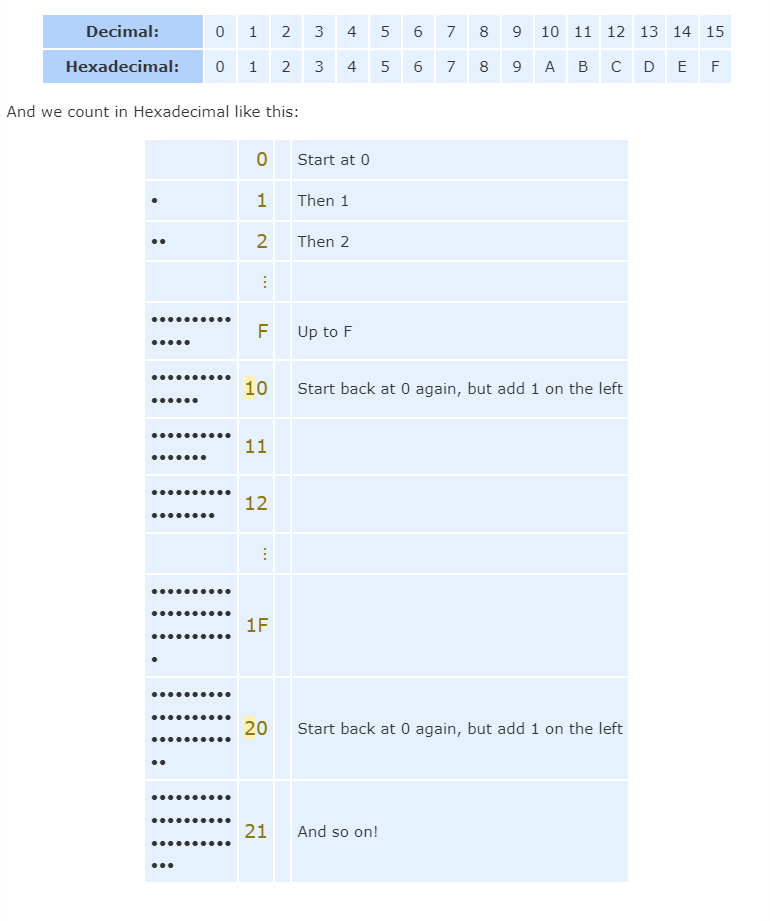

# Class 04

## Index

[Home](../README.md)
[What Is an Object](#what-is-an-object)  
[What do classes and sub-classes look like](#what-do-classes-and-sub-classes-look-like)  
[Binary, Decimal and Hexadecimal Numbers](#binary-decimal-and-hexadecimal-numbers)

## [What Is an Object?](https://docs.oracle.com/javase/tutorial/java/concepts/)

- Objects can be defined as having `state` and `behavoir`.

---

- Pen (State)
  - Deployed
  - Retracted
- Pen (behavior)
  - Dispense Ink

---

- Tape Dispenser (State)
  - Loaded
  - Empty
- Tape Dispenser (Behavior)
  - Dispense Tape

---

- Microphone (State)
  - On
  - Off
  - Pattern
    - Omnidirectional
    - Cardioid
    - Figure-8
    - Shotgun
  - Mute
    - On
    - Off
  - Gain
  - Volume

- Microphone (Behavior)
  - Volume Level Change
  - Gain Level Change

---

- Key questions to ask about objects are
  - "What possible states can this object be in?"
  - "What possible behavior can this object perform?

  


## [What do classes and sub-classes look like?](https://docs.oracle.com/javase/tutorial/java/javaOO/classes.html)

Here is sample code for a possible implementation of a Bicycle class, to give you an overview of a class declaration.  

```java
public class Bicycle {
        
    // the Bicycle class has
    // three fields
    public int cadence;
    public int gear;
    public int speed;
        
    // the Bicycle class has
    // one constructor
    public Bicycle(int startCadence, int startSpeed, int startGear) {
        gear = startGear;
        cadence = startCadence;
        speed = startSpeed;
    }
        
    // the Bicycle class has
    // four methods
    public void setCadence(int newValue) {
        cadence = newValue;
    }
        
    public void setGear(int newValue) {
        gear = newValue;
    }
        
    public void applyBrake(int decrement) {
        speed -= decrement;
    }
        
    public void speedUp(int increment) {
        speed += increment;
    }
        
}
```

A class declaration for a MountainBike class that is a subclass of Bicycle might look like this:

```java
public class MountainBike extends Bicycle {
        
    // the MountainBike subclass has
    // one field
    public int seatHeight;

    // the MountainBike subclass has
    // one constructor
    public MountainBike(int startHeight, int startCadence,
                        int startSpeed, int startGear) {
        super(startCadence, startSpeed, startGear);
        seatHeight = startHeight;
    }   
        
    // the MountainBike subclass has
    // one method
    public void setHeight(int newValue) {
        seatHeight = newValue;
    }   
}
```

MountainBike inherits all the fields and methods of Bicycle and adds the field seatHeight and a method to set it (mountain bikes have seats that can be moved up and down as the terrain demands).

## [Binary, Decimal and Hexadecimal Numbers](https://www.mathsisfun.com/binary-decimal-hexadecimal.html)

### Binary

Binary Numbers are just "Base 2" instead of "Base 10". So you start counting at 0, then 1, then you run out of digits ... so you start back at 0 again, but increase the number on the left by 1.



### Decimal Numbers

Every digit in a decimal number has a "position", and the decimal point helps us to know which position is which:

  

### Hexadecimal Numbers

Hexadecimal numbers are a base 16 system for counting values meaning a single Hexadecimal digit can show 16 different values instead of the normal 10 like this:



[Back To Top](#class-04)
