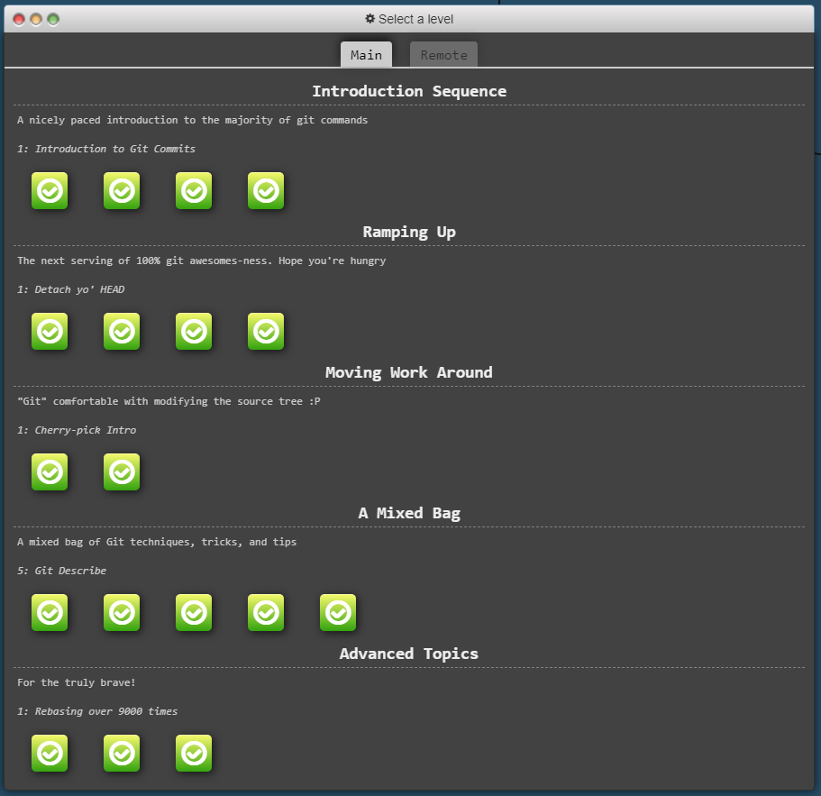
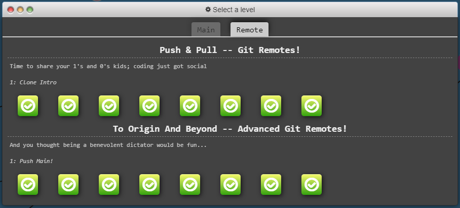
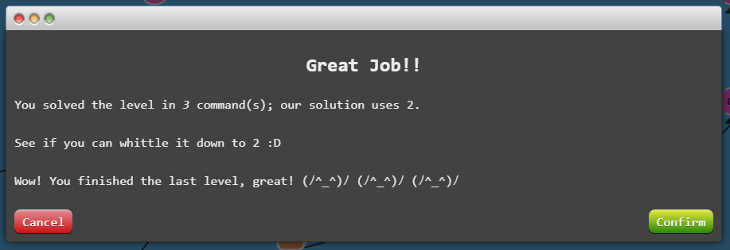

# [GIT Practice](https://learngitbranching.js.org/)

A visual course for learning Git branching. These are the results of the tutorials.

## Index

[Home](../README.md)  
[Practice Results](#practice-results)

## Practice Results

  
  
  

[Back To Top](#git-practice)
