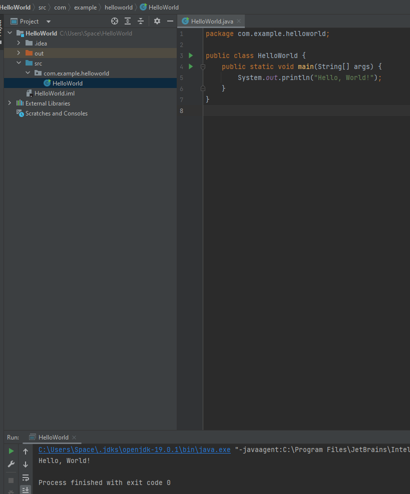
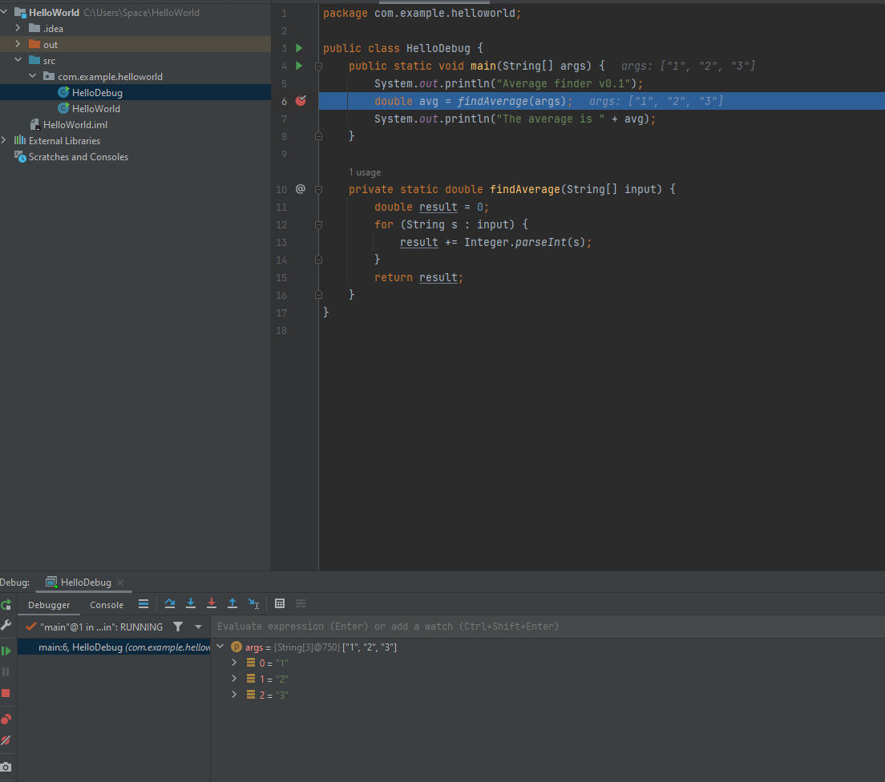
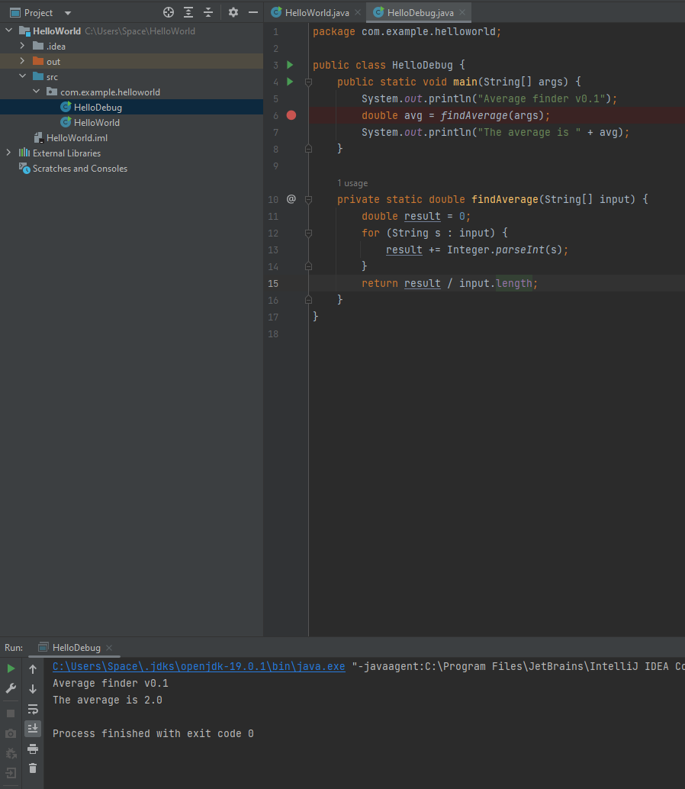

# [IntelliJ Practice and Debugging Java]

[IntelliJ Practice](https://www.jetbrains.com/help/idea/creating-and-running-your-first-java-application.html)  

[Debugging Java](https://www.jetbrains.com/help/idea/debugging-your-first-java-application.html)

## Index

[Home](../README.md)  
[Debugging Step Definitions](#debugging-step-definitions)  
[Program and Debug Images](#program-and-debug-images)

## Debugging Step Definitions

- `Breakpoint` is a tag set on a specific line where the debugger should pause (break) the running process and display the Debug Tool which has debug information about the current state.

- `Step-to-next-line` is a debug function that moves the process one step forward in the current scope.

- `Step-inside-function-call` is a debug function that step into a method on the line where the breakpoint is placed then each step will visit any other methods in the order of execution.

- `Step-out-of-function-call` lets the program continue until a return or its equivalent is encountered. Generally this is used once finished examining whatever value is in question and now want to see where it is used.

## Program and Debug Images

[Back To Top](#intellij-practice-and-debugging-java)
