# [Introduction to SQL](https://sqlbolt.com/lesson/introduction)

## Index

[Home](../README.md)  
[What is SQL](#what-is-sql)  
[Relational Databases](#relational-databases)  
[Results of Tutorials](#results-of-tutorials)  

## What is SQL

As stated by SQLBolt.com's introduction to SQL  

"SQL, or Structured Query Language, is a language designed to allow both technical and non-technical users query, manipulate, and transform data from a relational database. And due to its simplicity, SQL databases provide safe and scalable storage for millions of websites and mobile applications.  

There are many popular SQL databases including SQLite, MySQL, Postgres, Oracle and Microsoft SQL Server. All of them support the common SQL language standard, which is what this site will be teaching, but each implementation can differ in the additional features and storage types it supports."

## Relational Databases

Again, taken from SQLBolt.com's introduction to SQL  

"Before learning the SQL syntax, it's important to have a model for what a relational database actually is. A relational database represents a collection of related `(two-dimensional)` tables. Each of the tables are similar to an Excel spreadsheet, with a fixed number of named columns `(the attributes or properties of the table)` and any number of rows of data.

For example, if the Department of Motor Vehicles had a database, you might find a table containing all the known vehicles that people in the state are driving. This table might need to store the model name, type, number of wheels, and number of doors of each vehicle for example."

## Results of Tutorials

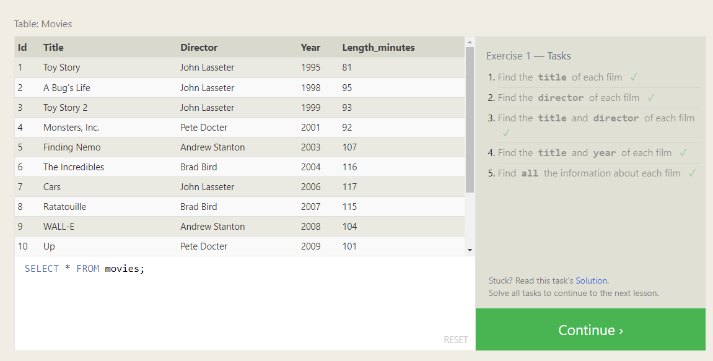  
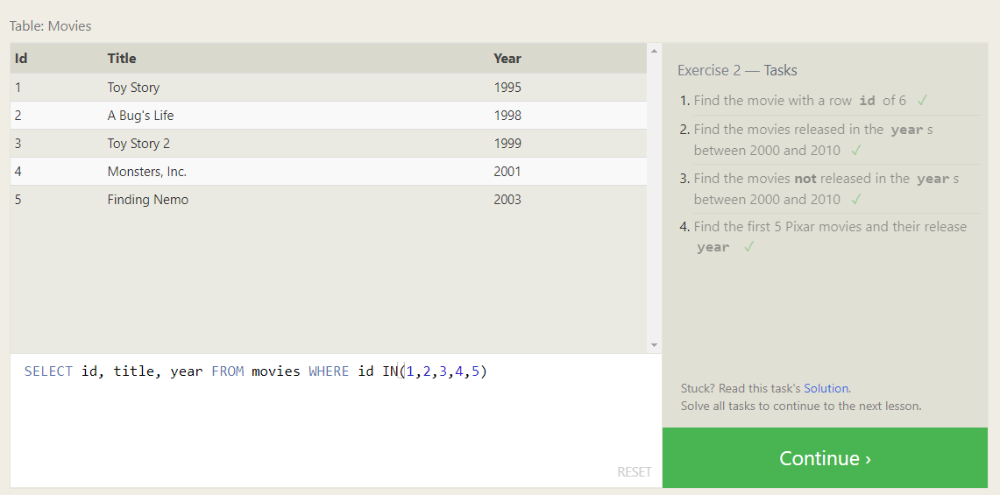  
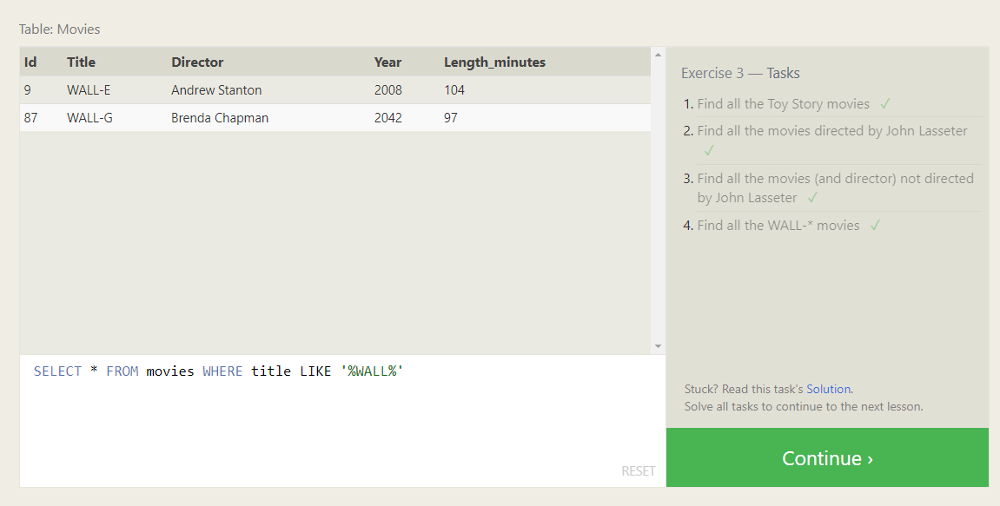  
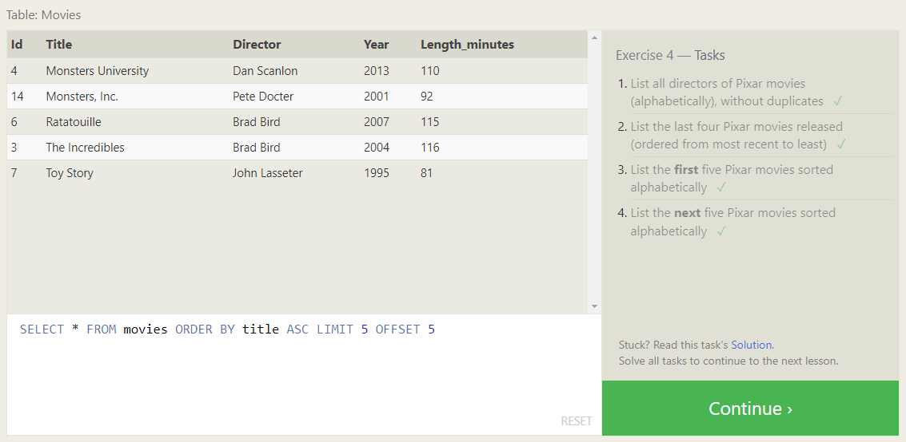  
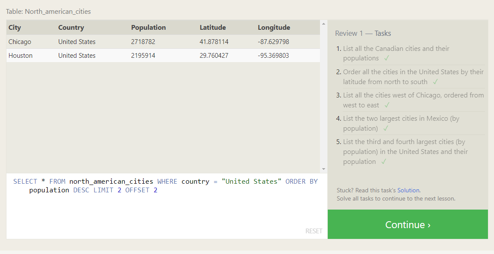  
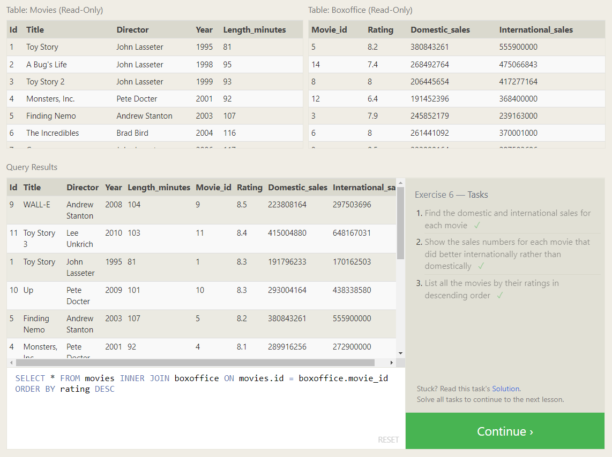  
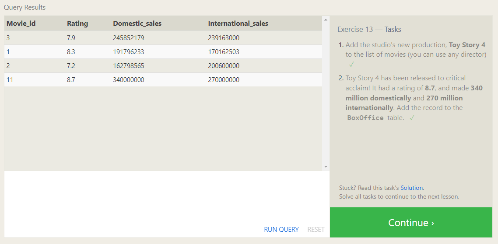  
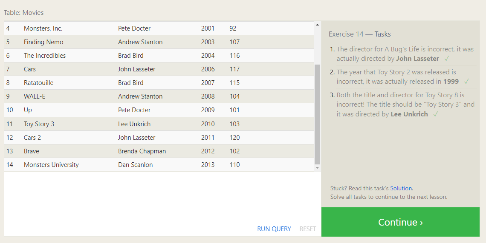  
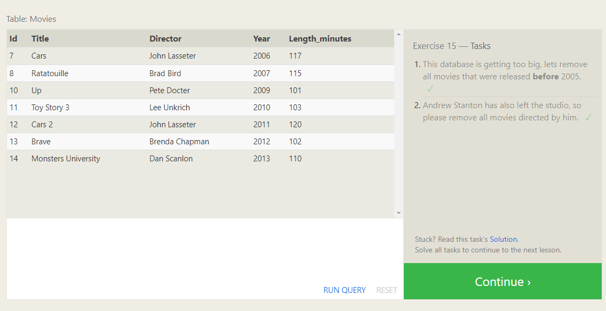  
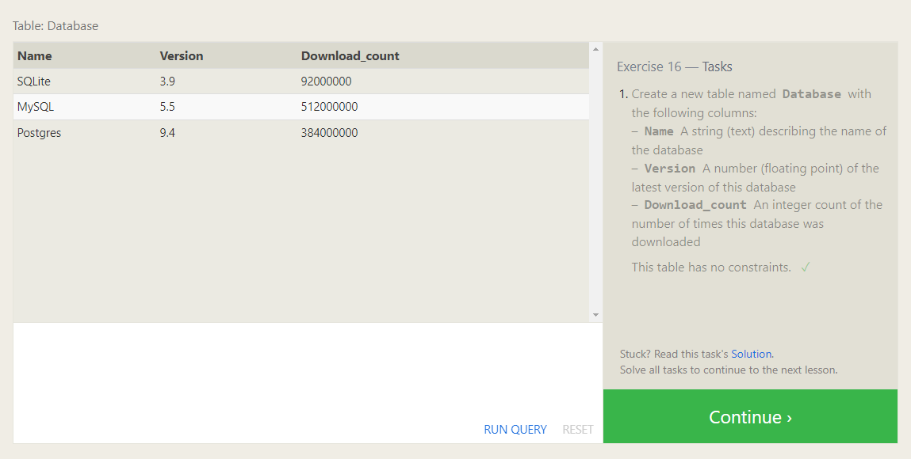  
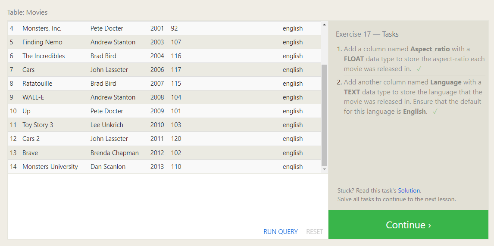  
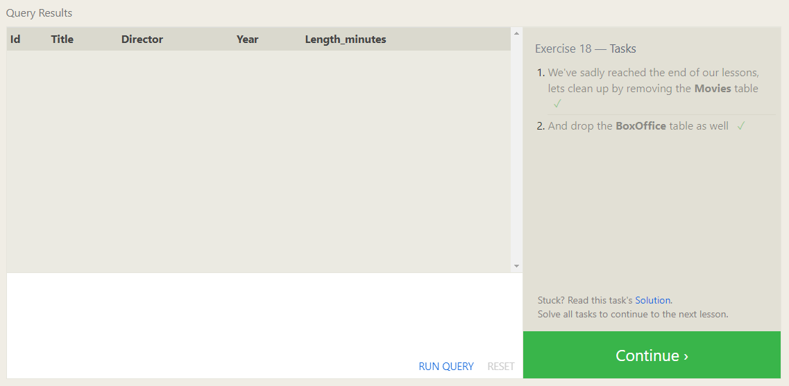  

[Back To Top](#introduction-to-sql)
