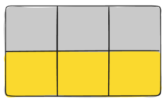

# Audio, Video, Images

## Index

[Home](README.md)  
[Video and Audio Content](#video-and-audio-content)  
[A Complete Guide to Grid](#a-complete-guide-to-grid)  
[Responsive Images](#responsive-images)  

## [Video and Audio Content](https://developer.mozilla.org/en-US/docs/Learn/HTML/Multimedia_and_embedding/Video_and_audio_content)

1. Explain how the ability to use video and audio on the web has evolved since the early 2000s.
   - native web technologies such as HTML didn't have the ability to embed video and audio on the Web, so proprietary (or plugin-based) technologies like [Flash](https://en.wikipedia.org/wiki/Adobe_Flash) — and later, [Silverlight](https://en.wikipedia.org/wiki/Microsoft_Silverlight) (both of which are now obsolete) — became popular for handling such content. This kind of technology worked OK, but it had a number of problems, including not working well with HTML/CSS features, security issues, and accessibility issues.  
   A native solution would solve much of this if implemented correctly. Fortunately, a few years later the [HTML5](https://developer.mozilla.org/en-US/docs/Glossary/HTML5) specification had such features added, with the [\<video\>](https://developer.mozilla.org/en-US/docs/Web/HTML/Element/video) and [\<audio\>](https://developer.mozilla.org/en-US/docs/Web/HTML/Element/audio) elements, and some shiny new JavaScript APIs for controlling them.
2. Describe the use of the `src` and `controls` attributes in the `<video>` element.
   - [src](https://developer.mozilla.org/en-US/docs/Web/HTML/Element/video#attr-src) In the same way as for the `` element, the `src` (source) attribute contains a path to the video you want to embed. It works in exactly the same way.
   - [controls](https://developer.mozilla.org/en-US/docs/Web/HTML/Element/video#attr-controls) Users must be able to control video and audio playback (it's especially critical for people who have epilepsy.) You must either use the controls attribute to include the browser's own control interface, or build your interface using the appropriate JavaScript API. At a minimum, the interface must include a way to start and stop the media, and to adjust the volume.
3. Why is it important to have fallback content inside the `<video>` element?
   - Fallback content is texted placed using the `<p>` element between the `<video>` element. It will be displayed if the browser accessing the page doesn't support the `<video>` element, allowing us to provide a fallback for older browsers. This can be anything you like such as a link to where the video actually lives so the user can at least access it some way regardless of what browser they are using.
   
4. Write a very short story where `<audio>` and `<video>` are characters.
   - Audio and video are the coolest around, they bring all the images and sound.  They embed them in the very fabric of the net, so you can find things like clips of Boba Fett.

## [A Complete Guide to Grid](https://css-tricks.com/snippets/css/complete-guide-grid/)

1. How does Grid layout differ from Flex?
   - [Flexbox](https://css-tricks.com/snippets/css/a-guide-to-flexbox/) is a one dimensional flow whereas `Grid` is two dimentional.  These two work very well together making for dynamic fluid website design.
2. Grid container, grid item, and grid line are a few important terms to understand when using Grid. Please describe these terms in a few sentences.
   - The `Grid Container` is the element on which display: grid is applied. It’s the direct parent of all the grid items. In this example container is the grid container.
   - `Grid Lines` are the dividing lines that make up the structure of the grid. They can be either vertical (“column grid lines”) or horizontal (“row grid lines”) and reside on either side of a row or column.
   - `Grid Cells` are the space between two adjacent row and two adjacent column grid lines. It’s a single “unit” of the grid.
   - `Grid Area` is the total space surrounded by four grid lines. A grid area may be composed of any number of grid cells.
   - `Grid Items` are the children (i.e. direct descendants) of the grid container.
   - `Grid Tracks` are the space between two adjacent grid lines. You can think of them as the columns or rows of the grid.

- Grid Container

```html
<div class="container">
  <div class="item item-1"> </div>
  <div class="item item-2"> </div>
  <div class="item item-3"> </div>
</div>

- Grid Item

```html
<div class="container">
  <div class="item"> </div>
  <div class="item">
    <p class="sub-item"> </p>
  </div>
  <div class="item"> </div>
</div>
```

- Grid Line  


- Grid Track  


- Grid Cell  


- Grid Area  

  
## [Responsive Images](https://developer.mozilla.org/en-US/docs/Learn/HTML/Multimedia_and_embedding/Responsive_images)

1. Besides making a site visually appealing across different screen sizes, why should developers make images responsive?
   - Most devices have differnt displays and each requires attention to make sure the idea the website is trying to convey stays in tact.
   - Keeping load times low to conserve bandwidth for whatever it's needed for.
2. Define the following `` attributes `srcset` and `sizes`. Write an example of how they are used.
   - These two attributes are used to make the user experience for devices with different bandwidth and screen sizes as smooth as possible. Ultimately they do the following:
     1. Look at its device width.
     2. Work out which media condition in the `sizes` list is the first one to be true.
     3. Look at the slot size given to that media query.
     4. Load the image referenced in the `srcset` list that has the same size as the slot or, if there isn't one, the first image that is bigger than the chosen slot size.
   - [srcset](https://developer.mozilla.org/en-US/docs/Web/HTML/Element/img#attr-srcset) defines the set of images we will allow the browser to choose between, and what size each image is. Each set of image information is separated from the previous one by a comma.
     1. An image filename (`elva-fairy-480w.jpg`)
     2. A space
     3. The image's intrinsic width in pixels (`480w`) — note that this uses the w unit, not px as you might expect. An image's intrinsic size is its real size
   - [sizes](https://developer.mozilla.org/en-US/docs/Web/HTML/Element/img#attr-sizes) defines a set of media conditions (e.g. screen widths) and indicates what image size would be best to choose, when certain media conditions are true — these are the hints we talked about earlier. In this case.
     1. A media condition (`(max-width:600px)`) — you'll learn more about these in the CSS topic, but for now let's just say that a media condition describes a possible state that the screen can be in. In this case, we are saying "when the viewport width is 600 pixels or less".
     2. A space
     3. The width of the slot the image will fill when the media condition is true (`480px`)

    ```html
    
    ```

3. How is srcset more helpful for responsive images than CSS or JavaScript?
   - When the browser starts to load a page, it starts to download (preload) any images before the main parser has started to load and interpret the page's CSS and JavaScript. That mechanism is useful in general for reducing page load times, but it is not helpful for responsive images — hence the need to implement solutions like srcset. For example, you couldn't load the `` element, then detect the viewport width with JavaScript, and then dynamically change the source image to a smaller one if desired. **By then, the original image would already have been loaded, and you would load the small image as well, which is even worse in responsive image terms.**

[Back to Top](#index)
